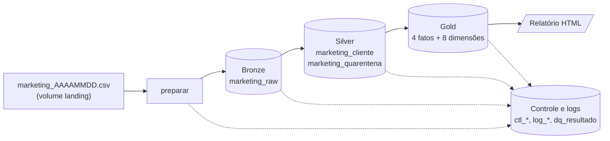

# Pipeline de Dados de Marketing — Databricks + Delta Lake

Pipeline batch, parametrizado por data, que transforma o arquivo `marketing_AAAAMMDD.csv` em um modelo dimensional
(estrela) pronto para BI, na arquitetura **Medalhão**, com controle de cargas, logs, qualidade de dados,
governança no Unity Catalog, CI/CD (GitHub Actions) e uma página HTML de relatórios.



## Início rápido

Pré-requisitos: Python 3.12, [Databricks CLI](https://docs.databricks.com/dev-tools/cli/install) (`databricks auth login --host <URL>`), Git.

```powershell
python -m venv .venv ; .\.venv\Scripts\Activate.ps1
pip install -e ".[dev,connect,tools]"

pytest tests/unit                                  # testes sem Spark (segundos)
$env:MKT_TEST_SPARK="connect"; pytest tests/spark  # testes de Spark no serverless do seu workspace

.\scripts\executar_job.ps1 -Target dev             # deploy + executa o job
python scripts/verificar_carga.py --catalog workspace --prefixo mkt_dev --data-carga 2026-09-20
python scripts/gerar_relatorio_local.py --catalog workspace --prefixo mkt_dev --saida out/relatorio.html
```

Para carregar um arquivo: copie `marketing_AAAAMMDD.csv` para o volume de landing do ambiente e execute o job.

```powershell
databricks fs cp data/raw/marketing_20260920.csv dbfs:/Volumes/workspace/mkt_dev_landing/arquivos/
databricks bundle run marketing_pipeline -t dev                                   # todos os arquivos pendentes
databricks bundle run marketing_pipeline -t dev --params data_carga=2026-09-20    # uma data
databricks bundle run marketing_pipeline -t dev --params data_carga=2026-09-20,reprocessar=true
```

## Estrutura do repositório

| Caminho | Conteúdo |
|---|---|
| `databricks.yml`, `resources/` | Asset Bundle: schemas, volumes, job (serverless) e targets `dev` / `stg` / `prod` |
| `src/mkt_pipeline/` | Pacote Python (vira o wheel do job); ver tabela de módulos abaixo |
| `tests/unit`, `tests/spark` | Testes sem Spark e testes das transformações com Spark |
| `tests/fixtures/` | Amostra de 300 linhas usada pelo STG no CI |
| `scripts/` | Execução do job, smoke test de dados, relatório local, gerador de cargas de teste |
| `.github/workflows/` | `ci-cd.yml` (Testing → Packing → STG → PROD) e `executar-carga.yml` (operação manual) |
| `docs/` | Arquitetura, operação e setup do CI/CD |

| Módulo | Responsabilidade |
|---|---|
| `config.py` | Nomes de catálogo/schemas/tabelas por ambiente (validados contra injeção de SQL) |
| `schema.py` | Contrato do CSV, domínios, estados da carga |
| `params.py` | Parâmetros padrão + leitura de `ctl_parametro` |
| `ddl.py` | DDL de todas as tabelas Delta |
| `control.py` | Setup, máquina de estados das cargas, `log_execucao`, `log_erro` |
| `runner.py` | Executor por carga: isola falhas por data e mantém o estado |
| `files.py` | Descoberta/validação de arquivos na landing |
| `bronze.py` / `silver.py` / `gold.py` | As três camadas |
| `dq.py` | Regras de qualidade declarativas |
| `governance.py`, `metadata.py` | Comentários, tags, FKs, dicionário de dados |
| `report.py` | Página HTML |
| `cli.py`, `pipeline.py` | Ponto de entrada (`mkt-pipeline <comando>`) e as etapas do job |

Mais detalhes: [docs/arquitetura.md](docs/arquitetura.md) · [docs/operacao.md](docs/operacao.md) · [docs/cicd.md](docs/cicd.md)

## Segurança

- Nenhum segredo no repositório. `Databricks-access.json`, `.env` e `.databrickscfg` estão no `.gitignore`.
- Localmente a autenticação é OAuth (`databricks auth login`). No CI, um token guardado como *secret* do GitHub Environment.
- Nomes de catálogo/schema vindos de parâmetros de job são validados (`^[A-Za-z_][A-Za-z0-9_]*$`) antes de entrarem em SQL.
- Colunas pessoais/financeiras (`id_cliente`, `ano_nascimento`, `salario_anual`, `idade`) recebem a tag `classificacao = confidencial`.
