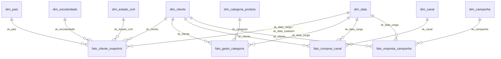
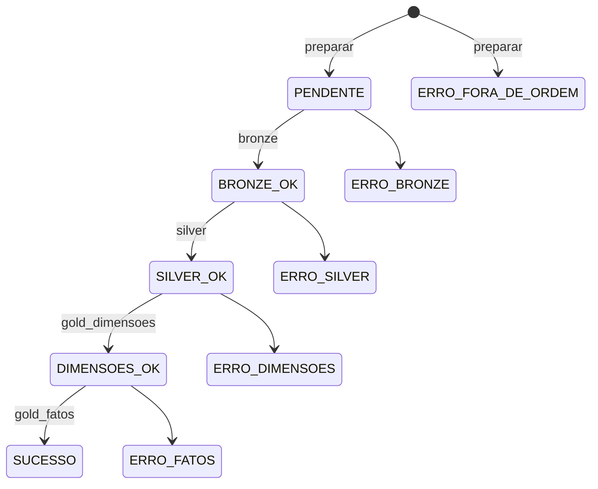

# Arquitetura

## 1. Ambientes

Um único workspace (Free Edition) e um único catálogo (`workspace`). Cada ambiente tem seus próprios schemas,
identificados por prefixo — o isolamento é **lógico**, definido pelo bundle:

| Target | Prefixo | Schemas |
|---|---|---|
| `dev` | `mkt_dev` | `mkt_dev_landing`, `_bronze`, `_silver`, `_gold`, `_ctl` |
| `stg` | `mkt_stg` | idem com `mkt_stg` |
| `prod` | `mkt_prod` | idem com `mkt_prod` |

Em um workspace pago com vários catálogos, basta alterar a variável `catalog` (ou o mapeamento por target) em
`databricks.yml`; nenhum código Python muda.

## 2. Camadas do Medalhão

| Camada | Tabela(s) | Regra de ouro |
|---|---|---|
| Landing | volume `arquivos` (CSV) e `relatorios` (HTML) | Arquivo é imutável; o nome carrega a data da carga |
| Bronze | `marketing_raw` | Tudo `STRING`, fiel ao arquivo. Só acrescenta auditoria (`_data_carga`, `_arquivo_origem`, `_ingestao_ts`, `_run_id`, `_seq_linha`, `_hash_linha`) |
| Silver | `marketing_cliente`, `marketing_quarentena` | Tipagem, padronização, regras de qualidade, métricas derivadas. Linha inválida vai para a quarentena, nunca some |
| Gold | 8 dimensões + 4 fatos | Modelo estrela para BI; chaves substitutas; SCD Tipo 2 no cliente |
| Controle | `ctl_parametro`, `ctl_etapa`, `ctl_carga_arquivo`, `log_execucao`, `log_erro`, `dq_resultado`, `dicionario_dados` | Todo o comportamento operacional é observável e configurável por tabela |

Todas as tabelas são Delta gerenciadas pelo Unity Catalog, com liquid clustering (`CLUSTER BY`) por carga,
Change Data Feed em silver/gold, chaves PK/FK informativas na gold e `NOT NULL` nas chaves.

## 3. Modelo dimensional (Gold)

**Granularidade dos fatos** (todos por carga, `sk_data_carga` = AAAAMMDD):

| Fato | Grão | Medidas |
|---|---|---|
| `fato_cliente_snapshot` | cliente × carga | gasto total, compras (total e por canal), desconto, recência, visitas, campanhas aceitas, conversão, salário, idade |
| `fato_gasto_categoria` | cliente × categoria × carga | `valor_gasto` |
| `fato_compras_canal` | cliente × canal × carga | `qtd_compras` |
| `fato_resposta_campanha` | cliente × campanha × carga | `aceitou` (0/1) |

**Chaves substitutas.** Dimensões pequenas (`pais`, `escolaridade`, `estado_civil`, `categoria`, `canal`, `campanha`)
usam `xxhash64(valor_de_negócio)`: determinístico, igual em qualquer ambiente, sem tabela de sequência nem *lookup*
na carga dos fatos. `dim_data` usa `AAAAMMDD`. `dim_cliente` usa `xxhash64(id_cliente, inicio_vigencia)`.

**SCD Tipo 2 em `dim_cliente`.** Atributos rastreados: `ano_nascimento`, `escolaridade`, `estado_civil`, `pais`,
`salario_anual`, `qtd_filhos`, `qtd_adolescentes`. O `hash_atributos` detecta mudança; ao mudar, a versão vigente é
fechada (`fim_vigencia = data_carga - 1`, `flag_atual = false`) e uma nova é aberta (`inicio_vigencia = data_carga`,
`fim_vigencia = 9999-12-31`). Os fatos apontam para a versão vigente **na data da carga**, então o histórico de
análise nunca é reescrito. Reprocessar a *mesma* data corrige a versão no lugar (não cria vigência invertida).

Limitações conhecidas: cliente que some de um arquivo continua com `flag_atual = true` (não há exclusão lógica);
o SCD exige ordem cronológica, por isso arquivos anteriores à última carga com sucesso são recusados
(`ERRO_FORA_DE_ORDEM`) e só a última carga pode ser reprocessada.

## 4. Job (Lakeflow Jobs, serverless)

`relatorio` roda com `run_if: ALL_DONE`: a página é gerada mesmo quando uma etapa falha (mostra o erro).
Cada task é uma chamada ao entry point do wheel: `mkt-pipeline <comando> --ambiente --catalog --prefixo --run-id`.
O `run_id` é o `{{job.run_id}}` — o mesmo identificador liga `log_execucao`, `log_erro`, `dq_resultado` e
`ctl_carga_arquivo`.

## 5. Máquina de estados da carga (`ctl_carga_arquivo.status`)

Cada etapa só processa cargas **desta execução** (`run_id_ultimo = run_id`) no estado esperado, em ordem de data.
Se uma data falha, só ela vai para `ERRO_<etapa>`; as outras seguem. A etapa termina com erro para o job ficar
vermelho e o alerta disparar. Em erro, uma nova execução `auto` tenta de novo até `max_tentativas`.

## 6. Idempotência

Reexecutar nunca duplica dados:

- Bronze, silver e fatos: `writeTo(...).overwrite(_data_carga = X)` — troca atomicamente só a fatia da carga.
- Dimensões: `MERGE` (insere só o que falta; SCD2 por hash).
- Controle: `MERGE` por `data_carga`; parâmetros só são semeados se não existirem (edições manuais preservadas).
- Reprocesso explícito (`data_carga=AAAA-MM-DD, reprocessar=true`) zera as tentativas e refaz a data.

## 7. Governança

- **Catálogo e linhagem:** Unity Catalog registra a linhagem tabela/coluna automaticamente.
- **Documentação viva:** `metadata.py` alimenta comentários de tabela/coluna, tags e a tabela `ctl.dicionario_dados`.
- **Classificação:** tag `classificacao=confidencial` em colunas pessoais/financeiras.
- **Qualidade:** 11 regras (`dq.py`) — 4 bloqueantes (quarentena) e 7 de alerta — com resultado por carga em `dq_resultado`.
- **Contratos:** cabeçalho do CSV validado contra `schema.py` (coluna faltando = falha; coluna extra = aviso).
- **Trilha de auditoria:** `log_execucao` (o quê/quando/quanto), `log_erro` (stacktrace), `_run_id` em toda linha.
- **Infra como código:** schemas e volumes só existem via bundle; nada é criado à mão.

## 8. Regras de qualidade

| Código | Severidade | Regra | Ação |
|---|---|---|---|
| R001 | Bloqueante | `id_cliente` nulo ou não numérico | Quarentena |
| R002 | Bloqueante | `id_cliente` repetido na carga | Quarentena (mantém a 1ª) |
| R003 | Bloqueante | `data_cadastro` inválida/ausente | Quarentena |
| R004 | Bloqueante | Valor negativo (gasto, contagem, salário) | Quarentena |
| A001 | Alerta | Salário ausente | Sinaliza |
| A002 | Alerta | Salário > `salario_max_outlier` | Sinaliza |
| A003 | Alerta | Ano de nascimento ausente/fora da faixa | Vira `NULL` + sinaliza |
| A004 | Alerta | Conteúdo idêntico (exceto ID) em mais de um cliente | Sinaliza |
| A005 | Alerta | `data_cadastro` posterior à carga | Sinaliza |
| A006 | Alerta | Escolaridade/estado civil fora do domínio | Sinaliza |
| A007 | Alerta | Campo numérico não convertido | Sinaliza |

Se a quarentena passar de `limite_rejeicao_pct` (padrão 10%), a carga **falha** e nada é gravado na silver.

## 9. Parametrização (`ctl_parametro`)

Editável sem deploy (`UPDATE ... SET valor = ...`). Padrões semeados: prefixo/extensão do arquivo, separador e
encoding do CSV, formato de data, `ano_nascimento_min`, `salario_max_outlier`, `limite_rejeicao_pct`,
`max_tentativas`, limites das faixas salariais e intervalo do calendário. `ctl_etapa.ativo = false` desliga uma etapa
(*kill switch*) sem alterar o job.

## 10. Decisões e trade-offs

| Decisão | Por quê |
|---|---|
| Batch com `spark.read` explícito, não Auto Loader | A carga é parametrizada por data e precisa de controle por arquivo; o volume do CSV é pequeno |
| Wheel + entry point, não notebooks | Testável, versionável, reutilizável entre ambientes e no CI |
| `xxhash64` como chave substituta | Determinismo entre ambientes e cargas sem lookup |
| `try_cast`/`try_to_timestamp` | O serverless roda com ANSI ligado: valor inválido lançaria erro em vez de virar `NULL` para as regras tratarem |
| Sem `CHECK` constraints | O Unity Catalog do Free Edition só aceita PK/FK; as regras ficam na quarentena |
| Governança *best-effort* | Falha ao aplicar uma tag vira aviso em `log_erro`, sem derrubar a carga de dados |
