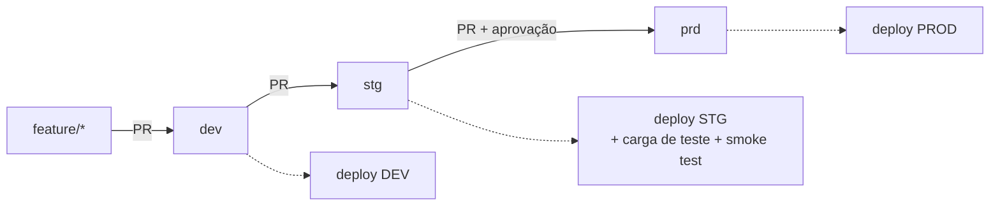

# CI/CD

Modelo **uma branch por ambiente**: cada merge/push na branch implanta no ambiente correspondente.

| Evento | Estágios executados |
|---|---|
| Pull request (para `main`, `dev`, `stg` ou `prd`) | 1 Testing → 2 Packing (nada é implantado) |
| Push em `main` | 1 Testing → 2 Packing |
| Push em `dev` | 1 Testing → 2 Packing → **3 DEV** (`bundle deploy -t dev`) |
| Push em `stg` | 1 Testing → 2 Packing → **3 STG** (deploy + carga de teste + smoke test) |
| Push em `prd` | 1 Testing → 2 Packing → **4 PROD** (aprovação manual + deploy + execução) |

| Estágio | O que faz | Falha se |
|---|---|---|
| 1 Testing | `ruff check`, `ruff format --check`, `pytest tests/unit`, `pytest tests/spark` (PySpark local, Java 17) | lint, formatação ou teste quebrar |
| 2 Packing | `python -m build --wheel`, `scripts/verificar_wheel.py`, guarda o `.whl` como artifact | wheel sem módulos ou sem entry point |
| DEV | `bundle validate` + `bundle deploy -t dev` (não executa o job) | bundle inválido ou deploy falhar |
| STG | `bundle validate` + `bundle deploy -t stg`, envia 2 arquivos (base + derivado com SCD2 e linhas inválidas), roda o job, roda `verificar_carga.py` nas duas datas, gera e publica o relatório | job falhar ou qualquer reconciliação de dados falhar |
| PROD | `bundle validate` + `bundle deploy -t prod`, roda o job (processa o que houver na landing de PROD), publica o relatório | job falhar |

PROD só executa depois de **aprovação manual** (Required reviewers do GitHub Environment `prod`).
`executar-carga.yml` roda o job manualmente em `dev`/`stg`/`prod` (data específica, reprocesso) sem novo deploy.

> Como `stg` e `prd` só recebem código que já passou por `dev` e `stg`, proteja-as para aceitar **somente PR**
> (ver abaixo). Assim ninguém implanta em PROD com um push direto.

## Configuração necessária no GitHub (uma vez)

1. **Branches**: `main` (já existe), `dev`, `stg`, `prd`. Crie a partir da `main`.
2. **Environments** (Settings → Environments): `dev`, `stg` e `prod`. Em `prod`, marque *Required reviewers*
   e adicione quem aprova; restrinja o environment à branch `prd` (*Deployment branches*).
3. **Variável do repositório** (Settings → Secrets and variables → Actions → Variables):
   `DATABRICKS_HOST` = `https://dbc-121388c5-4b98.cloud.databricks.com`
4. **Secret em cada environment** (`dev`, `stg`, `prod`): `DATABRICKS_TOKEN`.
   Gere em Databricks → Settings → Developer → Access tokens; use validade curta.
5. **Proteção das branches** (Settings → Branches → Add rule) para `dev`, `stg`, `prd`: exigir Pull Request e
   os checks *1 - Testing* e *2 - Packing*.

> Free Edition: não há service principals, então o token é pessoal. Em um workspace pago, prefira um *service
> principal* com OAuth M2M (`DATABRICKS_CLIENT_ID` / `DATABRICKS_CLIENT_SECRET`) e `run_as` nos jobs de PROD.

## Fluxo de trabalho

1. `git switch dev && git switch -c feature/minha-mudanca` → altere código/testes →
   `pytest tests/unit` (e `tests/spark` se mexeu em transformação).
2. Abra PR para `dev`: roda Testing + Packing. Ao mesclar, implanta em DEV.
3. Valide em DEV; abra PR `dev → stg`. Ao mesclar, implanta em STG e roda o smoke test.
4. Com STG verde, abra PR `stg → prd`. Ao mesclar, o job espera a aprovação e então implanta em PROD.

## Detalhes de projeto

- O wheel é reconstruído pelo bundle a cada deploy a partir do mesmo *commit* testado. O artifact do estágio
  Packing serve de evidência/auditoria; se quiser "construir uma vez, promover o mesmo binário", troque o
  `artifacts.build` do bundle por um `files` apontando para o wheel baixado do artifact.
- STG usa arquivos com datas fixas (`2026-01-01` e `2026-01-02`). Reexecuções do CI são idempotentes: cargas já
  concluídas não são refeitas, e o smoke test continua validando o estado final.
- A versão do pacote está em `src/mkt_pipeline/__init__.py` e é gravada em `log_execucao.versao_pacote`.
